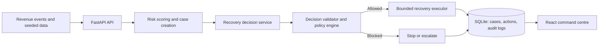

# RecoverAI

### AI Revenue Recovery Agent

**Catches revenue before it's gone for good, and tries to win some of it back — without doing anything reckless.**

RecoverAI watches for revenue at risk, works out what's actually going on with the payment or checkout, picks a safe way to try to recover it, carries out that action, and tracks how much money actually comes back.

**Detect → Diagnose → Decide → Act → Stop/Escalate → Measure**

---

## The Problem

Revenue leaks out in small, boring ways: a payment fails, or someone abandons checkout halfway through. A dashboard will show you that this happened, but someone still has to decide what to do about it — retry the payment, send a payment link, ask for a new card, escalate it, or just let it go.

Doing that by hand is slow and people handle similar cases differently. Automating it completely is risky, because now something is retrying payments and messaging customers with no one checking. RecoverAI sits between those two problems: every signal becomes a recovery workflow, but the workflow only gets to do what a policy says it's allowed to do.

---

## The Solution

RecoverAI is a full-stack prototype for two types of revenue-risk cases:

- **Payment failures** — assesses payment amount, failure reason, previous retries, and customer payment history.
- **Checkout abandonment** — assesses checkout value, risk score, and time since abandonment.

For every case, the system selects a recovery strategy, validates it against an allow-list and policy rules, executes only the permitted action, records the outcome, and preserves an audit trail.

---

## Results

The following baseline is produced by resetting the included seed data and running one recovery batch.

| Metric | Seeded Batch Result |
|---|---:|
| Cases processed | 18 |
| Revenue at risk | ₹558,787.00 |
| Cases recovered | 12 |
| Revenue recovered | ₹150,523.40 |
| Case recovery rate | 66.67% |
| Revenue recovery rate | 26.94% |
| Cases escalated | 4 |
| Cases stopped | 2 |
| Cases policy-blocked | 0 |

> **Note:** Case recovery rate is cases recovered ÷ cases processed (12/18). Revenue recovery rate is revenue recovered ÷ revenue at risk (₹150,523.40 ÷ ₹558,787.00) — a lower figure because recovered cases skew toward smaller amounts.

---

## Why It Matters

Flagging a failed payment is the easy part — most dashboards already do that. The harder part is doing something about it without a person having to babysit every case, and without that automation going rogue on a high-value account. RecoverAI is built around one number that actually matters: **how much revenue it got back**, not how many cases it noticed.

---

## Why This Is an Agent, Not Just a Dashboard

The React dashboard is just the window into the system. The actual agent is the backend loop that runs on each case:

1. **Picks up** a revenue-risk event, along with the customer and payment context around it.
2. **Works out the risk** from the payment value, history, failure reason, retry count, and recovery type.
3. **Decides** what to do about that specific case.
4. **Acts**, but only through a recovery executor that has hard limits on what it can do.
5. **Stops or escalates** once recovery succeeds, an escalation is warranted, a policy blocks the action, or it's hit an attempt limit.
6. **Writes down what happened** at every step, so there's a case history you can actually audit.

The version submitted here uses a deterministic decision service, so results are safe and repeatable to demo. There's also an optional Gemini-backed agent for experimenting with model-generated recommendations. Either way, the model never gets direct write access to money — it can only propose. The decision service and the Gemini agent talk to the same interface, so you can swap one in for the other, but the allow-list, policy engine, and stopping rules are what actually decide whether an action runs.

---

## How It Works

```text
Revenue event
     |
Risk detection and case creation
     |
Customer/payment diagnosis
     |
Recovery decision
     |
Decision validation + policy check
     |
Bounded action
     |
Recovered / Escalated / Stopped / Policy blocked
     |
Metrics + audit trail
```

### Key Capabilities

- Revenue-risk detection for failed payments and abandoned checkouts
- Customer and payment-context diagnosis
- Risk score, recovery probability, and expected-recovery calculation
- Recovery-strategy selection per recovery type
- Bounded simulated payment retry, payment-link/reminder, close, and escalation actions
- Retry limits, workflow attempt limits, and terminal-status protection
- Policy validation and action allow-lists
- Case-level audit trail and recovery analytics
- Single-case and batch execution from the dashboard

---

## Architecture



| Layer | Implementation |
|---|---|
| Frontend | React 19, Vite, Axios, Lucide React |
| Backend | Python, FastAPI, Uvicorn |
| Persistence | SQLAlchemy and SQLite |
| Recovery engine | Risk engine, decision validator, policy engine, stopping rules, deterministic payment simulator |

---

## Example Workflow

**Scenario: a previously reliable customer has a recoverable payment failure.**

```text
Payment failed: PAY-2001
     |
Diagnosis: strong payment history + insufficient-funds failure + high recovery probability
     |
Decision: RETRY_PAYMENT
     |
Policy: action is permitted and retry budget remains
     |
Execution: deterministic payment retry
     |
Outcome: payment recovered, case marked RECOVERED, amount recorded
     |
Audit: detection, decision, policy check, action, result, and stop events saved
```

In contrast, high-value payment failures are escalated for finance review rather than retried automatically. Actions outside the relevant recovery-type allow-list are blocked.

---

## Safety Controls

| Control | Purpose |
|---|---|
| Action allow-list | Prevents an invalid recovery action from being executed. |
| Policy validation | Applies high-value protection and recovery-type rules. |
| Retry limits | Prevents repeated automatic payment retries. |
| Attempt limits | Stops a case after two workflow attempts. |
| Terminal statuses | Prevents completed, stopped, escalated, or blocked cases from running again. |
| Amount bounds | Never records more recovered revenue than the amount at risk. |
| Audit logging | Captures the evidence behind every workflow stage. |

---

## Product Walkthrough

1. Open the command centre to view revenue at risk, recovered revenue, active cases, and escalations.
2. Select **Run recovery batch** to evaluate every actionable case.
3. Open **Recovery cases** to inspect a case's recommendation, confidence, expected recovery, and outcome.
4. Open **Audit trail** to inspect the evidence recorded for each decision and action.

<!--
Optional but recommended before submission: add 2-3 screenshots so an evaluator can see the product without running it.
    docs/
    └── screenshots/
        ├── dashboard.png
        ├── recovery-case.png
        └── audit-trail.png
Then embed them here, e.g.:


-->

---

<!--## Demo

🎥 **5-minute walkthrough:** [Watch the RecoverAI demo](YOUR_VIDEO_LINK)

<!-- Suggested flow while recording: reset the data, start both servers, show the dashboard,
     execute a batch, inspect one recovered or escalated case, finish in the audit trail.
     Remove this comment once the video is recorded and linked above. -->

---

## Run Locally

### Prerequisites

- Python 3.11+
- Node.js 20.19+ (or current LTS) and npm

### 1. Start the Backend

From the repository root:

```powershell
cd backend
python -m venv .venv
venv\Scripts\Activate
pip install -r requirements.txt
python -m data.seed_data
uvicorn main:app --reload
```

The API runs at `http://127.0.0.1:8000`; Swagger documentation is at `http://127.0.0.1:8000/docs`.

### 2. Start the Frontend

In a second terminal from the repository root:

```powershell
cd frontend
npm install
npm run dev
```

Open the URL printed by Vite, normally `http://localhost:5173`. The frontend is configured to call `http://127.0.0.1:8000` in `frontend/src/App.jsx`.

### 3. Reset the Demo

Run this from `backend/` whenever you need a fresh demonstration:

```powershell
python -m data.seed_data
```

This intentionally clears and reseeds the local SQLite demo database (`backend/recoverai.db`). No real payments, messages, or external recovery actions are performed.

---

## API Summary

| Method | Endpoint | Purpose |
|---|---|---|
| `GET` | `/` | API health and service-status response. |
| `GET` | `/analytics/revenue` | Revenue and case metrics for the dashboard. |
| `GET` | `/recovery/cases` | All recovery cases, ordered by risk score. |
| `GET` | `/recovery/risk-feed` | Active priority queue. |
| `GET` | `/recovery/{case_id}` | Returns details for one recovery case. |
| `GET` | `/recovery/audit/{case_id}` | Returns the audit history for one case. |
| `POST` | `/recovery/detect` | Creates cases from failed payments. |
| `POST` | `/recovery/detect-checkouts` | Creates checkout-abandonment cases. |
| `POST` | `/recovery/batch/execute` | Processes all actionable cases. |
| `POST` | `/recovery/cases/{case_id}/execute` | Processes one recovery case. |
| `POST` | `/recovery/checkout/{case_id}/execute` | Processes one checkout-abandonment case. |


---

## Project Structure

```text
RecoverAI/
  backend/
    agents/          # Optional Gemini-based decision agent
    api/              # Recovery and analytics routes
    data/              # Repeatable demo-data seeding
    database/       # SQLAlchemy models and SQLite configuration
    services/         # Risk, policy, workflow, audit, and recovery logic
    main.py            # FastAPI entry point
    requirements.txt
  frontend/
    src/App.jsx        # Dashboard and API integration
    src/App.css        # Dashboard styling
```

---

## Limitations and Next Steps

RecoverAI is a prototype. A production version should add:

- Authentication and role-based access
- Environment-based configuration
- Real provider integrations
- Background jobs
- Secure secret management
- Database migrations
- Observability
- Automated tests
- Human approval for high-impact actions
